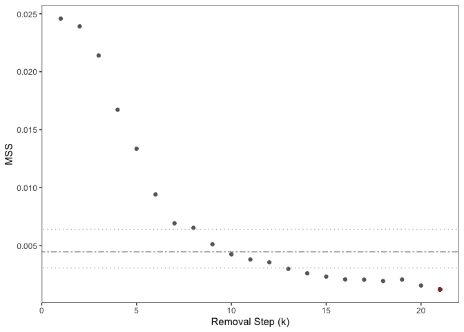

README
================
Michael B. Sohn
10/14/2023

## OPTIMEM: Optimal Normalization Method for Sparse Compositional Data

The optimem function determines non-differentially abundant (non-DA)
taxa that are used to remove the compositional effects using a
sequential removal and random amalgamation procedure. For detailed
information about the arguments, please see the documentation for
*optimem()*.

Note: OPTIMEM is computationally intensive. It may take a few hours,
depending on the number of features (e.g., taxa) and the proportion of
removed features at each removal step (eta). As a default, eta is set at
a very small value (\< 1/(number of features)), so one feature is
removed at a time. It has to be increased if the number of features is
greater than several hundreds. In this case, we recommend using large
numbers of the random selection and amalgamation steps (e.g., n.b=500,
n.r=1000). Note n.b will be ignored when eta is set at a very small
value.

### Installation

install.packages(“devtools”)

devtools::install_github(“mbsohn/optimem”)

### Example: Determine non-ADA taxa

``` r
library(optimem)
# Simulate a dataset using a negative binomial model
set.seed(2023)
p <- 100; n.non.da <- sample(40:90, 1)
non.da.mu <- sample(1:100, n.non.da, rep=TRUE)
da.mu1 <- sample(1:100, p-n.non.da, rep=TRUE)
da.mu2 <- sample(1:100, p-n.non.da, rep=TRUE)
mu1 <- c(da.mu1, non.da.mu); mu2 <- c(da.mu2, non.da.mu)
sz <- 1; n1 <- 50; n2 <- 50
dat1 <- t(replicate(n1, MASS::rnegbin(length(mu1), mu1*sample(1:10, 1), sz)))
dat2 <- t(replicate(n2, MASS::rnegbin(length(mu1), mu2*sample(1:10, 1), sz)))
M <- proportions(rbind(dat1, dat2), margin=1)
n.sample <- nrow(M); n.taxa <- ncol(M)
y <- c(rep(1, n1), rep(2, n2))
colnames(M) <- paste0("T", 1:n.taxa)
true.da.taxa <- colnames(M)[which(mu1 != mu2)]
# Run OPTIMEM
rslt <- optimem(M, y)
```

<!-- -->

### Differential abundance analysis using non-ADA taxa as a reference

``` r
det.nonDA <- rslt$nonDAtaxa_min
if(rslt$min_MSS < rslt$lower_limit_null){
     MDA <- sweep(M[,!(colnames(M) %in% det.nonDA)], 1, rowSums(M[, det.nonDA]), "/")
} else{
     MDA <- sweep(M, 1, rowSums(M[, det.nonDA]), "/")
}
DA.test <- apply(MDA, 2, function(x) wilcox.test(x~y)$p.value)
DA.p <- p.adjust(DA.test, method="BH")
names(which(DA.p < 0.05))
```

    ##  [1] "T1"  "T2"  "T5"  "T7"  "T8"  "T9"  "T10" "T11" "T13" "T14" "T16" "T18"
    ## [13] "T20" "T25" "T26" "T29" "T32" "T34" "T35" "T36" "T37" "T39" "T40" "T41"
    ## [25] "T42" "T44" "T45" "T91"

To account for covariates, a probabilistic index model, which can be
seen as the rank-equivalent of the general linear model, can be used.
